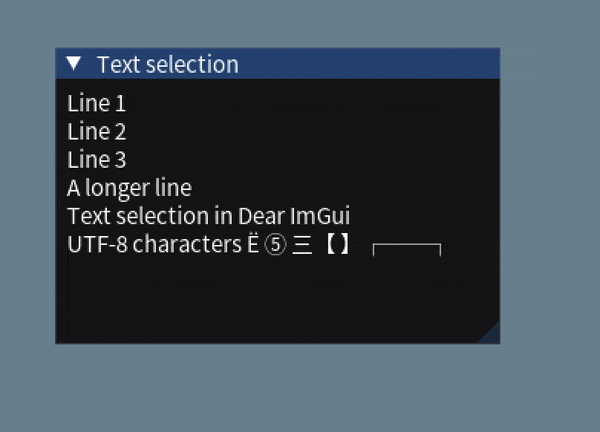

# ImGuiTextSelect

This is a text selection implementation for Dear ImGui, originally part of [WhaleConnect](https://github.com/WhaleConnect/whaleconnect).

Released under the MIT License.



## Features

- Double-click: Select word
- Triple-click: Select line
- Shift-click: Select range
- Keyboard shortcuts for copy (Ctrl+C/Cmd+C) and select all (Ctrl+A/Cmd+A)
- Automatic scrolling for selecting text outside the window's visible area
- Integration in context menus
- UTF-8 text support

## Dependencies

- [Dear ImGui](https://github.com/ocornut/imgui)
- [utfcpp](https://github.com/nemtrif/utfcpp) (For UTF-8 handling)
- C++17 or later

## Integration

Copy `textselect.cpp` and `textselect.hpp` into your project, and update your build settings to compile `textselect.cpp`. Also, copy utfcpp into your project so it can be included as `<utf8.h>`. (utfcpp is a header-only library so it does not need to be compiled.)

To apply text selection to a window:

1. `#include "textselect.hpp"`
2. Create a `TextSelect` instance for your window
3. Call `.update()` on your `TextSelect` instance in your window's render loop

See below for an example.

## Notes

- Only left-to-right text is supported
- Double-click selection only handles word boundary characters in Latin Unicode blocks
- Each line must be the same height (word wrapping is not supported)
- You should have `ImGuiWindowFlags_NoMove` set in either your window or a child window containing the text so mouse drags can be used to select text instead of moving the window
- The accessor functions (`getLineAtIdx`, `getNumLines`) should not contain side effects or heavy computations as they can potentially be called multiple times per frame

ImGuiTextSelect works well for text-only windows such as a console/log output or code display.

Some discussion on highlightable text in Dear ImGui: [GitHub issue](https://github.com/ocornut/imgui/issues/950)

## Example Usage

See [the example code](example/main.cpp) for a full program using ImGuiTextSelect. The example is compiled with the [xmake](https://xmake.io) build system.

```cpp
#include <string_view>
#include <vector>

#include "textselect.hpp"

// ---------- At the beginning of your program: ----------

// The lines to show in the window
// You will need to supply TextSelect instances with functions that:
//   1. Take a line number (starting from 0) and return that line in an std::string_view
//   2. Return the total number of lines in the window
// A vector is a convenient way to fulfill the above requirements, but you may use whatever you like.
std::vector<std::string_view> lines{
    "Line 1",
    "Line 2",
    "Line 3",
    "A longer line",
    "Text selection in Dear ImGui",
    "UTF-8 characters Ë ⑤ 三【 】┌──┐"
};

std::string_view getLineAtIdx(size_t idx) {
    return lines[idx];
}

size_t getNumLines() {
    return lines.size();
}

// Create a TextSelect instance
TextSelect textSelect{ getLineAtIdx, getNumLines };

// ---------- In the main render loop: ----------

// Create a window to contain the text
ImGui::SetNextWindowSize({ 300, 200 });
ImGui::Begin("Text selection");

// Create a child window with the "NoMove" flag
// This allows mouse drags to select text (instead of moving the window), while still
// allowing the window to be moved from the title bar.
ImGui::BeginChild("text", {}, 0, ImGuiWindowFlags_NoMove);

// Display each line
for (const auto& line : lines) {
    ImGui::TextUnformatted(line.data());
}

// Update TextSelect instance (all text selection is handled in this method)
textSelect.update();

// Register a context menu (optional)
// The TextSelect class provides the hasSelection, copy, and selectAll methods
// for manual control.
if (ImGui::BeginPopupContextWindow()) {
    ImGui::BeginDisabled(!textSelect.hasSelection());
    if (ImGui::MenuItem("Copy", "Ctrl+C")) {
        textSelect.copy();
    }
    ImGui::EndDisabled();

    if (ImGui::MenuItem("Select all", "Ctrl+A")) {
        textSelect.selectAll();
    }
    ImGui::EndPopup();
}

ImGui::EndChild();
ImGui::End();
```
